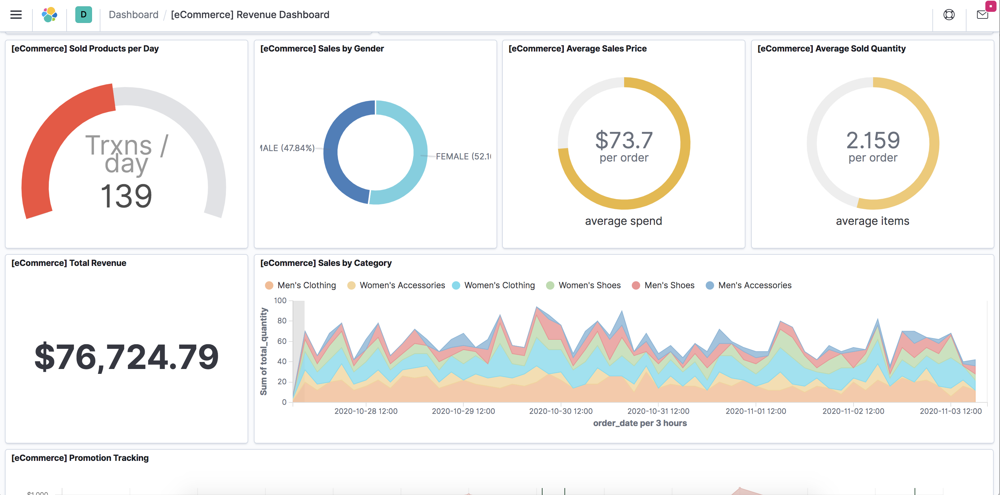

运行环境：macOS

下载地址：https://www.elastic.co/downloads

下载二进制包

wget https://artifacts.elastic.co/downloads/elasticsearch/elasticsearch-7.1.0-darwin-x86_64.tar.gz

wget https://artifacts.elastic.co/downloads/kibana/kibana-7.1.0-darwin-x86_64.tar.gz

wget https://artifacts.elastic.co/downloads/logstash/logstash-7.1.0.tar.gz

elasticsearch 7.1.0 自带java环境

```
运行elasticsearch
bin ./elasticsearch -d

运行kibana
./kibana

logstash导入测试数据
bin sudo ./logstash -f logstash.conf

elasticsearch监听的端口
http://127.0.0.1:9200/
kibana管理页面
http://127.0.0.1:5601
```


